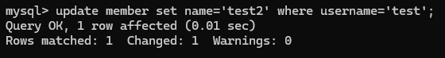

# WEEK5 Assignment

## Task2: Create database and table in your MySQL server 

* Create a new database named website.

語法
```
create database website;
```
執行結果


<br/>
<br/>
<br/>
* Create a new table named member, in the website database.

語法
```
create table member(
    id bigint primary key auto_increment comment 'Unique ID',
    name varchar(255) not null comment "Name',
    username varchar(255) not null comment 'Username',
    password varchar(255) not null comment 'Passsword',
    follower_count int unsigned not null default 0 comment 'Follower Count',
    time datetime not null default current_timestamp comment 'Signup Time');
```
執行結果


<br/>
<br/>
<br/>
<br/>
<br/>
<br/>

## Task3: SQL CRUD 

* INSERT a new row to the member table where name, username and password must 
be set to test. INSERT additional 4 rows with arbitrary data.

語法
```
insert into member(name, username, password, follower_count)values('test','test','test',55);
insert into member(name, username, password, follower_count)values('haha','zxc','asd',64);
insert into member(name, username, password, follower_count)values('today','is','Tuesday',502);
insert into member(name, username, password, follower_count)values('Melody','melody888','happy',100);
insert into member(name, username, password, follower_count)values('Sean','sean87','hdjfk',22);
```
執行結果


<br/>
<br/>
<br/>

* SELECT all rows from the member table. 

語法
```
select * from member;
```

執行結果


<br/>
<br/>
<br/>

* SELECT all rows from the member table, in descending order of time.

語法
```
select * from member order by time desc;
```
執行結果 


<br/>
<br/>
<br/>

* SELECT total 3 rows, second to fourth, from the member table, in descending order 
of time.

語法
```
select * from member order by time desc limit 1, 3 ;
```

執行結果


<br/>
<br/>
<br/>

* SELECT rows where username equals to test.

語法
```
select * from member where username='test';
```

執行結果


<br/>
<br/>
<br/>

* SELECT rows where name includes the es keyword.

語法
```
select * from member where name like '%es%';
```
執行結果


<br/>
<br/>
<br/>

* SELECT rows where both username and password equal to test. 

語法
```
select * from member where username='test' and password='test';
```

執行結果


<br/>
<br/>
<br/>

* UPDATE data in name column to test2 where username equals to test.
語法
```
update member set name='test2' where username='test';
```

執行結果


<br/>
<br/>
<br/>
<br/>
<br/>
<br/>

## Task4: SQL Aggregation Functions

* SELECT how many rows from the member table. 
語法
```
select count(id) from member;
```
執行結果


<br/>
<br/>
<br/>

* SELECT the sum of follower_count of all the rows from the member table.

語法
```
select sum(follower_count) from member;
```
執行結果


<br/>
<br/>
<br/>

* SELECT the average of follower_count of all the rows from the member table. 

語法
```
select avg(follower_count) from member;
```
執行結果


<br/>
<br/>
<br/>

* SELECT the average of follower_count of the first 2 rows, in descending order of 
follower_count, from the member table.

語法
```
select avg (follower_count) from (select follower_count from member order by time desc limit 2) as first2time;
```
執行結果


br/>
<br/>
<br/>
<br/>
<br/>
<br/>

## Task5: SQL JOIN 

* Create a new table named message, in the website database. designed as below: 

語法
```
create table message(id bigint primary key auto_increment comment 'Unique ID',
    -> member_id bigint not null comment 'Member ID for Message Sender',
    -> content varchar(255) not null comment 'Content',
    -> like_count int unsigned not null default 0 comment 'Like Count',
    -> time datetime not null default current_timestamp comment 'Publish Time',
    -> foreign key (member_id) references member (id));
```
執行結果


<br/>
<br/>
<br/>

* SELECT all messages, including sender names. We have to JOIN the member table to get that. 

語法
```
select message.*, member.name from message inner join member on message.member_id=member.id;
```
執行結果


<br/>
<br/>
<br/>

* SELECT all messages, including sender names, where sender username equals to 
test. We have to JOIN the member table to filter and get that.

語法
```
select message.*, member.name from message inner join member on message.member_id=member.id where username='test';
```
執行結果


<br/>
<br/>
<br/>

* Use SELECT, SQL Aggregation Functions with JOIN statement, get the average like 
count of messages where sender username equals to test.

語法
```
select avg(like_count) from (
    -> select message.*, 
    -> member.name from message inner join member 
    -> on message.member_id=member.id where username='test')
    -> as username_test;
```
執行結果


<br/>
<br/>
<br/>


* Use SELECT, SQL Aggregation Functions with JOIN statement, get the average like 
count of messages GROUP BY sender username.

語法
```
select username,avg(like_count)
    -> from (select message.*,member.username from message inner join member
    -> on message.member_id=member.id) as member_message
    -> group by username;
```
執行結果


<br/>


